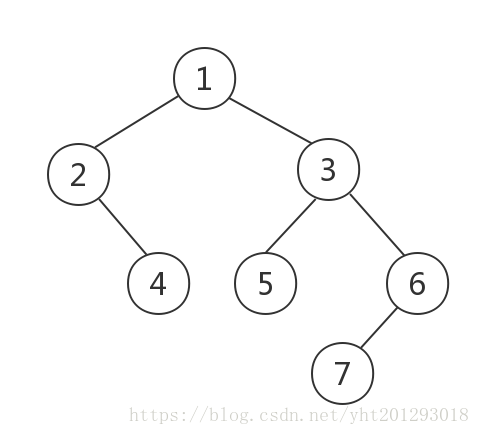

# 树的前、中、后序遍历
## 三种二叉树的遍历思想：
* 前序遍历：根节点 --> 左子树 --> 右子树
* 中序遍历：左子树 --> 根节点 --> 右子树
* 后序遍历：左子树 --> 右子树 --> 根节点

** 可以发现其实前中后代表的就是根节点遍历的顺序 **

例子：

前序遍历结果：1 2 4 3 5 6 7

中序遍历结果：2 4 1 5 3 7 6

后序遍历结果：4 2 5 7 6 3 1

## 规则
先序：考察到一个节点后，即刻输出该节点的值，并继续遍历其左右子树。

中序：考察到一个节点后，将其暂存，遍历完左子树后，再输出该节点的值，然后遍历右子树。

后序：考察到一个节点后，将其暂存，遍历完左右子树后，再输出该节点的值。
